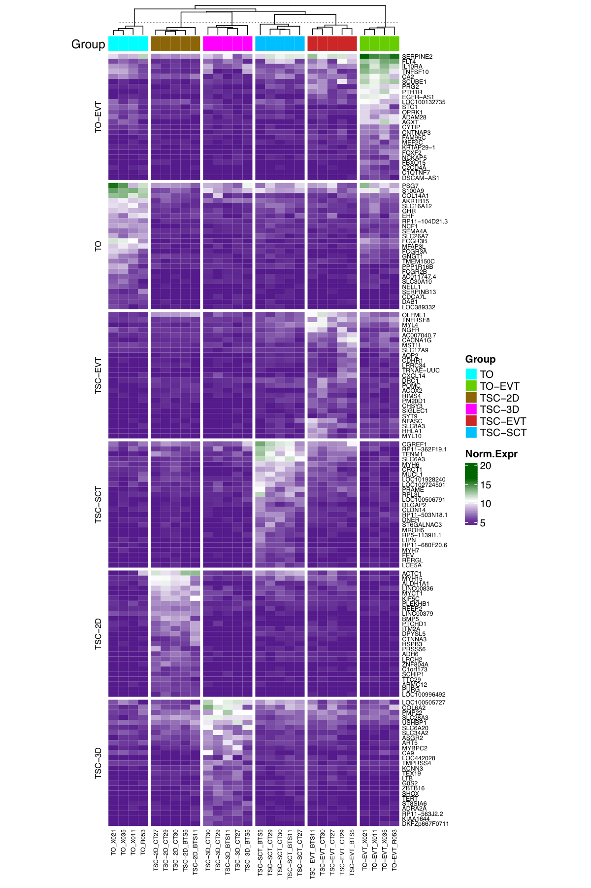

# Sheridan_Turco
# Characterization of in vitro human trophoblast models:advantages adn limitations
Megan A.Sheridan <sup>1,2^*</sup>, Xiahui Zhao<sup>2,3</sup>, Ridma C.Fernando<sup>1,2</sup>, Lucy Gardner<sup>1,2</sup>, Vicente Perez-Garcia<sup>1,2,3</sup>, Qian Li<sup>1,4</sup>, Steven G.E.Marsh<sup>5,6</sup>, Russell S. Hamilton<sup>2,4</sup>, Ashley Moffett<sup>1,2</sup> and Margherita Y Turco<sup>1,2^* </sup> <br>

Communications Biology volume 4, Article number: 651 (2021) [](https://doi.org/10.1038/s42003-021-02194-y) <br>
<sup>1</sup> Department of Pathology, University of Cambridge, Cambridge, UK <br>
<sup>2</sup> Centre for Trophoblast Research, University of Cambridge, UK. <br>
<sup>3</sup> Department of Physiology, Development and Neuroscience, University of Cambridge, Cambridge, UK <br>
<sup>4</sup> Department of Genetics, University of Cambridge, Cambridge, UK <br>
<sup>5</sup> Anthony Nolan Research Institute, Royal Free Hospital, London, UK <br>
<sup>6</sup> UCL Cancer Institute, Royal Free Campus, London, UK <br>

**Corresponding authors:** Megan A.Sheridan (mas289@cam.ac.uk) and Margherita Y.Turco (myt25@cam.ac.uk)

Code Release for this github: [](xxx)

## Abstract
Although understanding of human placental development is still limited, two models, trophoblast organoids and trophoblast stem cells (TSC) are new useful tools. Both differentiate from villous cytotrophoblast (VCT) to extravillous trophoblast (EVT) and syncytiotrophoblast (SCT). Here, we compared these models to identify which trophoblastthey resemble in vivo. A defining feature of human trophoblast is that VCT and SCT are HLA null whilst EVT express HLA-C,-G,-E molecules. We find that trophoblast organoids retain these in vivo characteristics. In contrast, TSC express classical HLA-A and HLA-B and maintain expression after EVT differentiation with upregulation of HLA-G. Furthermore, HLA expression in TSC differs when grown in 3D rather than 2D suggesting mechanical cues are important. We also compare transcriptomes and miRNA profiels in trophoblast models. Our findings indicate that TSC do not readily undergo spontaneous SCT differentiation. Our results will allow choice of the most suitable model to study trophoblast development, function and pathology.
## Data Availability

* RNASeq data: EMBL-EBI ArrayExpress **E-MTAB-10429**(https://www.ebi.ac.uk/arrayexpress/experiments/E-MTAB-10429/)
* Small RNA(miRNA) data: EMBL-EBI ArrayExpress **E-MTAB-10438**(https://www.ebi.ac.uk/arrayexpress/experiments/E-MTAB-10438/)

## Illumina TruSeq RNA library summary table (4 lanes 2 Runs, reverse stranded)
SampleTable_4Lanes_2Run_rmfluffy.csv[[csv](SampleTable_4Lanes_2Run_rmfluffy.csv)]

## RNASeq analysis Methods

mRNA and small RNA sequencing was run on the NextSeq 500 (Illumina) using a
75-cycle high output, which generated approximately 400 million reads per run.
Library prep for bulk mRNA sequencing was done following the manufacturer
recommended protocol by using the Truseq stranded mRNA library kit (Illumina).
Library prep for small RNA sequencing was done by using the Bioo Nextflex protocol
(NEXTFLEX Small RNA-seq Kit v3 for Illumina Platforms). Data were aligned to
GRCh38 human genome (iGenomes, NCBI). The alignment and QC were processed
using the Nextflow (Di Tommaso et al., 2017; Ewels et al., 2020) pipeline (version
20.01.0, https://nf-co.re/rnaseq) with the option “--aligner hisat2”. All scripts, with
details of software versions, a pipeline usage report and expression count files are
freely available from https://github.com/CTR-BFX/Sheridan_Turco. <br>

Differential gene expression was performed with DESeq2(Love, Huber and Anders,
2014) package (v1.26.0, R v3.6.2) (Team, 2020) and with the same package read
counts were normalised on the estimated size factors. A principal component
analysis (PCA) was performed using the top most variable 2000 genes using
variance stabilizing transformed expression for gene counts (SFig.3B). For each contrast,
differentially expressed genes with Benjamini–Hochberg (BH) adjusted p-values
<0.05 were identified. Significant differentially expressed genes from each
comparison was selected based on the adjusted p-values < 0.05 and absolute
log2FoldChange is greater than 1. For heatmaps (Fig.2A and SFig.3A), gene-level transcripts expression
values were derived by log2 normalized transformed values. ComplexHeatmap (v 2.6.2) was applied to generate the heatmap (Gu, Eils and Schlesner, 2016). To identify the key markers of each model and make unbiased clustering across six models, one against all DESeq2 analysis was performed for each model. Then order the log2FoldChange and adjusted pvalue, select the top up-regulated markers from each comparison and generate the heatmap SFig.3A. <br>

Gene Ontology (GO) and GO semantic similarity
pathway analysis was performed using R package clusterProfiler (v 3.14.3, Yu et al., 2012), GOSemSim (v 2.16.1, Yu et al. 2010) and rrvgo (v 1.2.0, Sayols S, 2020). Significant differential expressed genes identified using DESeq2 analysis between TSC-3D vs TO
were used as input. In order to check the enriched biological pathways for both up and down regulated DEGs identified as input, "compareCluster" function uses default clusterProfiler algorithm coupled with Fisher's exact test statistic (p ≤ 0.05,
q ≤ 0.05) is applied for the analysis. There are 36 up-regulated pathways and 15 down-regulated pathways identified (Fig 3A, Supplementary Data 1). Unbiased biological process gene ontology enriched pathway analysis is also performed for all DEGs, up-regulated DEGs and down-regulated DEGs. Based on the number of BP identified,  
GO semantic similarity is also performed to cluster genes into different clusters based on their functional similarity, and use it to measure the similarities among all/up/down GO BP terms to reduce the redundancy of GO enrichment results. Figures and corresponding GO semantic analysis are presented in SFig.4 (A,B,C) and Supplementary Data 2(A,B,C). GO plots were drawn using R package ggplot2 (v 3.3.2), enrichplot (v 1.10.2). <br>

Normalized read counts were used in the statistical analysis of mRNA abundance of
key genes. Raw sequencing reads are deposited at EMBL-EBI ArrayExpress with
experimental code **E-MTAB-10429**.


#  Analysis (QC--->DEGs---->GeneOntology + Transcriptome Factor analysis)

## Step 1: QC and Alignment pipeline (nextflow version 20.01.0, nf-core/rnaseq version 2.0)
SampleSheet_nextflow_reverse.csv[[csv](SampleSheet_nextflow_reverse.csv)] <br>
SampleSheet_Reverse_generate.R[[Rscript](./Scripts/SampleSheet_Reverse_generate.R)]

```shell
   nextflow run nf-core/rnaseq  -resume -bg -profile singularity -r 2.0 --singleEnd --skipBiotypeQC \
                                --input SampleSheet_nextflow_reverse.csv --genome GRCh38 --aligner hisat2 \
                                --email xz289@cam.ac.uk -with-report report_nextflow_reverse.html &> nextflow_command_reverse.resume.log &
```

**Software versions Table:**
| Software | Version|
|------------| --- |
|Nextflow	|v20.01.0|
|FastQC	|v0.11.8|
|Cutadapt|	v2.5|
|Trim Galore!|	v0.6.4|
SortMeRNA|	v2.1b|
|STAR|	vSTAR_2.6.1d|
|HISAT2|	v2.1.0|
|Picard MarkDuplicates|	v2.21.1|
|Samtools|	v1.9|
|featureCounts|	v1.6.4|
|Salmon|	v0.14.1|
|StringTie|	v2.0|
|Preseq|	v2.0.3|
|deepTools|	v3.3.1|
|RSeQC|	v3.0.1|
|dupRadar|	v1.14.0|
|edgeR|	v3.26.5|
|MultiQC|	v1.7 |

**FeatureCounts merged ".tsv" file** [[tsv](./Figures_Tables/featurecounts.merged.counts.tsv)]

## Step 2: Differential Analysis using R (v3.6.2) with DESeq2 (v1.26.0) & Gene Ontology Analysis

The analysis code is <br>
DESeq_GO_Analysis.R[[Rscript](./Scripts/DESeq_GO_Analysis.R)]

                 Design formula ~ condition

* DESeq2 analysis with all different models (TSC-2D, TSC-3D, TSC-EVT, TSC-STC, TO, TO-EVT)
* DESeq2 pairwise analysis (TSC-3D vs TO)  
* Gene Ontology analysis apply to the comparison **TSC-3D vs TO**


Corresponding results are given below

| Fig/Tab | Link   | Images |Legend |
| ----------------------------- | --- |----|----|
|Fig.2A | [[PDF](Figures_Tables/Fig.2A_PCA.pdf)] || Principal component analysis (PCA) with the top 2000 most variable genes of the trophoblast cell models: TO (n=4), TO-EVT (n=4), TSC-2D (n=5), TSC-3D (n=5), TSC-EVT (n=5), and TSC-SCT (n=5)|
|Fig.2B | [[PDF](Figures_Tables/Fig2B_SelMarkers_Heatmap.pdf)] ||  A heatmap of specific markers for each trophoblast subtype of the human first-trimester placenta. The markers are divided into the following groups: markers of pan-trophoblast, syncytiotrophoblast, cell column niche, and extravillous trophoblast. Hierarchical clustering is shown based on the average log2 normalized expression for each marker in each models.|
|Fig.3A | [[PDF](Figures_Tables/Fig3A_Reactome_BiologicalPathway_UP36_DW15_DotPlot.pdf)] || clusterProfiler biolgoical theme (reactome) comparison identified enriched pathways between up-regulated and down-regulated significant differential expressed genes for the DESeq2 model comparison TSC-3D vs TO models. The dot size represents the gene ratio which is the number of DEGs identified in the pathway divided by the total up/down DEGs. The colour of thd dots represents the adjusted p-values, blue and red colors signify the padj. Corresponding data for Fig3A is given in Supplementary_Data1.|
|Fig.4A | [[PDF](Figures_Tables/Fig4A_TSC3DvsTrophorg_sel_BP_Uponly_cell_shape_organisation_cnetplot.pdf)] || Gene concept network (CNET) plot to highlight the genes in common between 4 selected major biological process pathways upregulated in TSC-3D compared to TO. Corresponding data for this plot is Supplementary Data2B.|
|SFig.3A | [[PDF](Figures_Tables/SFig3A_Heatmap_sel25_upreg_new.pdf)] ||  Heatmap clustering for selected the top 25 up-regulated differentially expressed genes from DESeq2 analysis on all the one against comparison. Hierarchical clustering is shown based on log2 normalised expression.|
|SFig.3B | [[PDF](Figures_Tables/SFig3B_TSC-3DvsTO_collapse_Fig.PCA.pdf)] ||  Principal component analysis plot for the top 2000 most variable genes between TSC-3D and TO. Principal component 1 (PC1) accounted for 66% of the variance and separated the two groups. Genes associated with PC1 included a few syncytiotrophoblast (SCT) markers (PAPPA2, PSG1, VGLL3, PAPPA, PSG3, CSH1, PSG8, PLAC4, CGB5)|
|SFig.4A | [[PDF](Figures_Tables/SFig4A-TSC-3DvsTO_GOSeSim_allBP_BP_701_thresh_0.9_cluster23_scatterPlot.pdf)] || Gene ontology enriched Biological Process (BP) Pathways Semantic Similarity Analysis plot. There are total 23 clusters identified with 701 pathways, similarity parameter is 0.9. Corresponding plot data is Supplementary Data 2A.|
|SFig.4B | [[PDF](Figures_Tables/SFig4B-TSC3DvsTO_GOSeSim_BPUP_BP_575_thresh_0.9_cluster26_scatterPlot.pdf)] ||  Gene ontology up enriched Biological Process (BP) Pathways Semantic Similarity Analysis plot. There are total 26 clusters identified with 575 pathways, similarity parameter is 0.9. Corresponding plot data is Supplementary Data 2B.|
|SFig.4C | [[PDF](Figures_Tables/SFig4C-TSC3DvsTO_GOSeSim_BPDW_BP_169_thresh_0.9_cluster9_scatterPlot.pdf)] ||  Gene ontology down enriched Biological Process (BP) Pathways Semantic Similarity Analysis plot. There are total 9 clusters identified with 169 pathways, similarity parameter is 0.9. Corresponding plot data is Supplementary Data 2C.|
|SFig.xx | [[PDF](Figures_Tables/TFs_HLAs_2D_3D_Org.pdf)] ||  General TFs relating to HLAs normalised log2 transformed gene counts boxplot with Wilcox test. For the CIITA there are ties and it cannot calculate exact p-value. The yaxis did not start from 0.|
| ----------------------------- | --- |----|----|
|SData1_Fig3A | [[CSV](Figures_Tables/Supplementary_Data1_Fig3A_Reactome_BiologicalPathways_UP36_DW15_summary.csv)] || clusterProfiler biolgoical theme (reactome) comparison identified enriched pathways between up-regulated and down-regulated significant differential expressed genes for the DESeq2 model comparison TSC-3D vs TO models summary table. |
|SData2A_Fig4A_SFig4A | [[CSV](Figures_Tables/Supplementary_Data2A-TSC3DvsTO_GOSeSim_allBP_BP_N701_thresh_0.9_cluster23_summaryTable.csv)] ||  Gene ontology  all enriched Biological Process (BP) Pathways Semantic Similarity Analysis data summary table. There are total 23 clusters identified with 701 pathways, similarity parameter is 0.9.|
|SData2B_SFig4B | [[CSV](Figures_Tables/Supplementary_Data2B-TSC3DvsTO_GOSeSim_BPUP_BP_N575_thresh_0.9_cluster26_summaryTable.csv)] ||  Gene ontology up-regulated enriched Biological Process (BP) Pathways Semantic Similarity Analysis data summary table. There are total 23 clusters identified with 575 pathways, similarity parameter is 0.9.|
|SData2B_SFig4C | [[CSV](Figures_Tables/Supplementary_Data2C-TSC3DvsTO_GOSeSim_BPDW_BP_N169_thresh_0.9_cluster9_summaryTable.csv)] ||  Gene ontology down-regulated enriched Biological Process (BP) Pathways Semantic Similarity Analysis data summary table. There are total 9 clusters identified with 169 pathways, similarity parameter is 0.9.|
|TF_list | [[xlsx](Figures_Tables/Human_TFList.xlsx)] || Human Transcriptome Factor list. |
|TF_list_overlap | [[CSV](Figures_Tables/TSC3D_Trophorg_Up2257_overlap_TF_N328.csv)] || Human Transcriptome Factor list overlap with up-regulated DEGs in the model comparison TSC-3D vs TO.|


## Software R Versions & Methods

````
R version 3.6.2 (2019-12-12)
Platform: x86_64-apple-darwin15.6.0 (64-bit)
Running under: macOS  10.14.4

Platform: x86_64-pc-linux-gnu (64-bit)
Running under: Ubuntu 16.04.6 LTS

Matrix products: default
BLAS:   /storage/Software/packages/R-3.6.2/lib/libRblas.so
LAPACK: /storage/Software/packages/R-3.6.2/lib/libRlapack.so

Random number generation:
 RNG:     Mersenne-Twister
 Normal:  Inversion
 Sample:  Rounding

locale:
 [1] LC_CTYPE=en_GB.UTF-8       LC_NUMERIC=C              
 [3] LC_TIME=en_GB.UTF-8        LC_COLLATE=en_GB.UTF-8    
 [5] LC_MONETARY=en_GB.UTF-8    LC_MESSAGES=en_GB.UTF-8   
 [7] LC_PAPER=en_GB.UTF-8       LC_NAME=C                 
 [9] LC_ADDRESS=C               LC_TELEPHONE=C            
[11] LC_MEASUREMENT=en_GB.UTF-8 LC_IDENTIFICATION=C       

attached base packages:
[1] stats     graphics  grDevices utils     datasets  methods   base     

other attached packages:
 [1] ComplexHeatmap_2.5.1        apeglm_1.8.0               
 [3] limma_3.42.2                ggalt_0.4.0                
 [5] dplyr_0.8.5                 plyr_1.8.6                 
 [7] biomaRt_2.42.1              reshape2_1.4.4             
 [9] ggrepel_0.8.2               pheatmap_1.0.12            
[11] cowplot_1.0.0               RColorBrewer_1.1-2         
[13] ggplot2_3.3.0               DESeq2_1.26.0              
[15] SummarizedExperiment_1.16.1 DelayedArray_0.12.3        
[17] BiocParallel_1.20.1         matrixStats_0.56.0         
[19] Biobase_2.46.0              GenomicRanges_1.38.0       
[21] GenomeInfoDb_1.22.1         IRanges_2.20.2             
[23] S4Vectors_0.24.4            BiocGenerics_0.32.0
[25] clusterProfiler_3.14.3      rrvgo_1.2.0
.....           
````

## Contact

Contact Xiaohui Zhao (xz289 -at- cam.ac.uk) and Russell S.Hamilton (rsh46 -at- cam.ac.uk)
